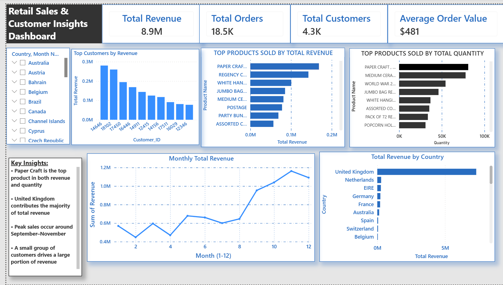

# Retail Sales Analysis Project (SQL + Power BI)

## Project Overview
This project analyses retail transaction data to uncover key business insights related to product performance, customer behaviour, and revenue trends. The analysis was performed using SQL for data cleaning and transformation, and Power BI for dashboard development and visualisation.

## Objectives
- Clean and prepare raw transactional data
- Identify top-performing products by revenue and quantity
- Analyse customer purchasing behaviour
- Explore revenue trends over time
- Build an interactive dashboard for business insights

## Tools & Technologies
- SQL Server (SSMS)
- SQL (Data Cleaning & Analysis)
- Power BI (Dashboard & Visualisation)

## Data Cleaning (SQL)
The raw dataset contained several inconsistencies which were handled using SQL:

- Removed missing `Customer_ID` values
- Excluded cancelled transactions (`Invoice LIKE 'C%'`)
- Filtered out invalid quantities (`Quantity <= 0`)
- Removed invalid prices (`UnitPrice <= 0`)
- Created a new `Revenue` column:
- Revenue = Quantity × UnitPrice

### Data Summary
- Original rows: 541,910  
- Cleaned rows: 397,881  
- Removed rows: 144,029  

## Key Insights

- **Top Product:** *Paper Craft, Little Birdie* leads in both revenue and quantity  
- **Top Country:** United Kingdom contributes the majority of revenue  
- **Seasonality:** Peak sales occur between September and November  
- **Customer Concentration:** A small group of customers generates a large portion of revenue  

## Dashboard Features

- KPI Cards:
- Total Revenue
- Total Orders
- Total Customers
- Average Order Value

- Visualisations:
- Top Products by Revenue
- Top Products by Quantity
- Revenue by Country
- Monthly Revenue Trend
- Top Customers by Revenue

- Interactive Filters:
- Country
- Month

## Dashboard Preview

## Business Value

This dashboard enables stakeholders to:

- Identify high-performing products
- Understand customer purchasing patterns
- Monitor revenue trends over time
- Support data-driven decision making

## Future Improvements

- Add profit margin analysis
- Perform customer segmentation (RFM analysis)
- Include predictive sales forecasting
- Enhance dashboard interactivity

## Author
Manasa Mohan Kumar
